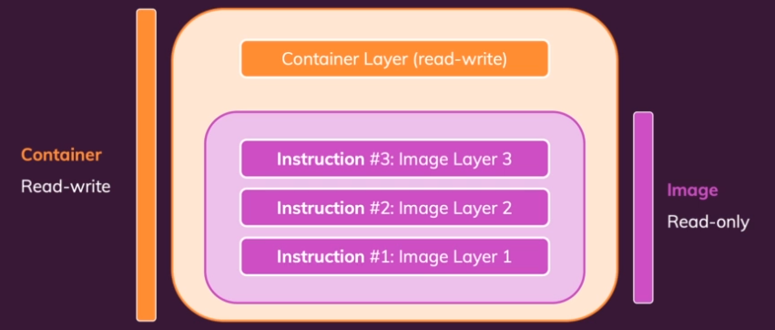
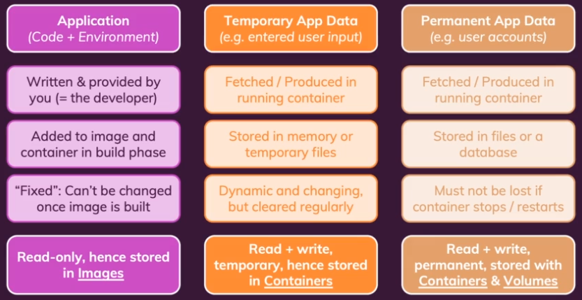
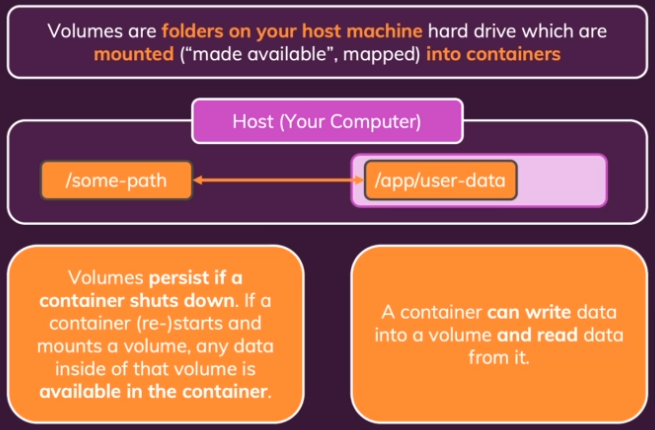
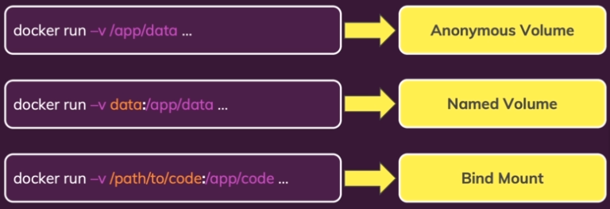
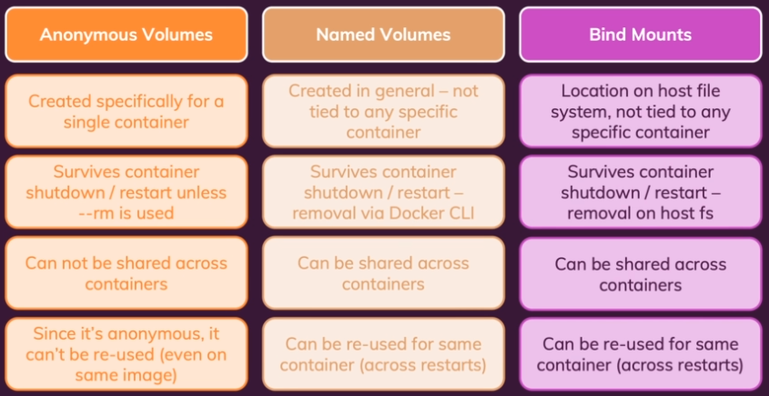
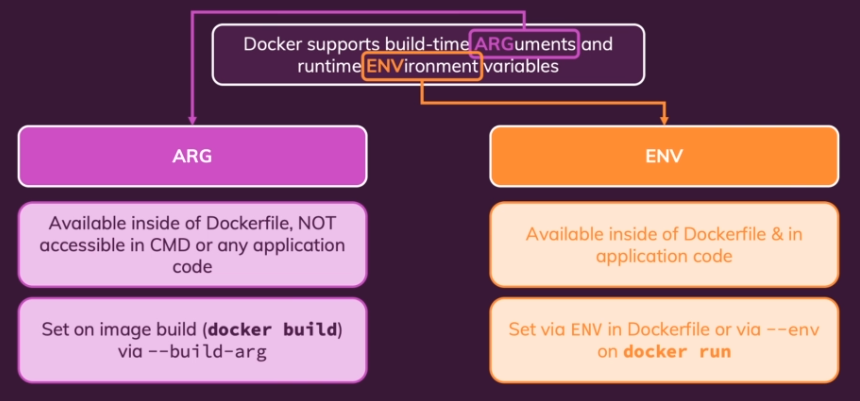

# Docker & Kubernetes: The Practical Guide

Notes taken from the [course](https://www.udemy.com/course/docker-kubernetes-the-practical-guide)

## Containers

A Docker container is a lightweight and portable software package that includes everything needed to run a piece of software, including the code, runtime, system tools, libraries, and settings. Containers are isolated environments that can run consistently across different computing environments, such as development, testing, and production.



### Containers Commands

- `docker ps`: list running containers
  - `-a`: list all containers
- `docker run`: creates a new container based on an image, and runs it (on foreground/attached)
  - `-d`: on background/detached
  - `-it`: interactive terminal
  - `-p <local_port>:<container_port>`: publish a container's port(s) to the host
- `docker start <container_name>`: runs a previously created container (on background/detached)
  - `-a`: on foreground/attached
  - `-i`: interactive
- `docker stop <container_name>` stops a running container
- `docker container attach <container_name>`: attaches to a detached container
- `docker rm <container_name>`: removes stopped containers
- `docker container prune`: removes all stopped containers at once
- `docker cp <origin_path> <destination_path>`: copy files between local/container
- `docker logs <container_name>`: list logs from a container
  - `-f`: keep attached

## Images

A Docker image is a lightweight, standalone, and executable package that contains all the necessary components to run a specific application, including the code, runtime, system tools, libraries, and settings. Docker images serve as a blueprint for creating Docker containers, which are isolated and reproducible runtime environments.

### Images Commands

- `docker build .`: builds an image from a Dockerfile on current folder
  - `-t <image_name>`: tags the image with a tag name
- `docker images`: list all images
- `docker image prune`: removes all unused images at once
- `docker image inspect <image_id>`: details an image
- `docker rmi <image_id>`: removes unused images
- `docker tag <previous_image_name> <new_image_name>`: clones previous image with a new tag name

## Registry

A Docker registry is a centralized repository where Docker images are stored, managed, and shared. It serves as a distribution hub for Docker images, allowing users to upload, download, and organize container images.

### Registry Commands

- `docker login`: logs into docker hub
- `docker logout`: logs out from docker hub
- `docker push <host:image_name>`: push image to a registry
- `docker pull <host:image_name>`: pull image from a registry

## Data & Volumes



Docker volumes are a feature that allows for the persistent storage and data sharing between Docker containers and between containers and the host system. They provide a way to manage and store data separately from the container itself.







### Volumes Commands

- `docker volume ls`: lists volumes
- `docker volume <volume_name>`: removes volume
- `docker volume prune`: removes anonymous local volumes not used by at least one container

## Arguments & Environment variables



### Environment variables

Dockerfile example:

Variables available on container runtime

```yml
ENV PORT 80 # declaration with default value
EXPOSE $PORT
```

CLI usage:

`docker run --env PORT=8000`  
`docker run --env-file ./.env`

### Argument variables

Variables available only on image build, inside Dockerfile, not accessible on runtime

Dockerfile example:

```yml
ARG DEFAULT_PORT=80
ENV PORT $DEFAULT_PORT
EXPOSE $PORT
```

CLI usage:

`docker build --build-arg DEFAULT_PORT=8000`

## Networking and cross-container communication
