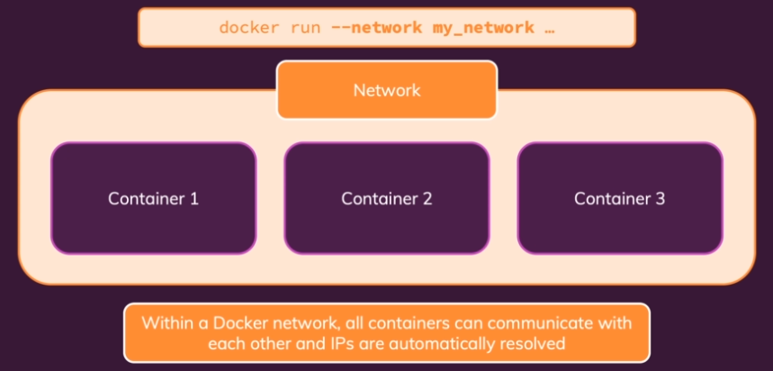

# Docker & Kubernetes: The Practical Guide

Notes taken from the [course](https://www.udemy.com/course/docker-kubernetes-the-practical-guide)

## Containers

A Docker container is a lightweight and portable software package that includes everything needed to run a piece of software, including the code, runtime, system tools, libraries, and settings. Containers are isolated environments that can run consistently across different computing environments, such as development, testing, and production.


### Containers Commands

- `docker ps`: list running containers
  - `-a`: list all containers
- `docker run`: creates a new container based on an image, and runs it (on foreground/attached)
  - `-d`: on background/detached
  - `-it`: interactive terminal
  - `-p <local_port>:<container_port>`: publish a container's port(s) to the host
- `docker start <container_name>`: runs a previously created container (on background/detached)
  - `-a`: on foreground/attached
  - `-i`: interactive
- `docker stop <container_name>` stops a running container
- `docker container attach <container_name>`: attaches to a detached container
- `docker rm <container_name>`: removes stopped containers
- `docker container prune`: removes all stopped containers at once
- `docker cp <origin_path> <destination_path>`: copy files between local/container
- `docker logs <container_name>`: list logs from a container
  - `-f`: keep attached

## Images

A Docker image is a lightweight, standalone, and executable package that contains all the necessary components to run a specific application, including the code, runtime, system tools, libraries, and settings. Docker images serve as a blueprint for creating Docker containers, which are isolated and reproducible runtime environments.

### Images Commands

- `docker build .`: builds an image from a Dockerfile on current folder
  - `-t <image_name>`: tags the image with a tag name
- `docker images`: list all images
- `docker image prune`: removes all unused images at once
- `docker image inspect <image_id>`: details an image
- `docker rmi <image_id>`: removes unused images
- `docker tag <previous_image_name> <new_image_name>`: clones previous image with a new tag name

## Registry

A Docker registry is a centralized repository where Docker images are stored, managed, and shared. It serves as a distribution hub for Docker images, allowing users to upload, download, and organize container images.

### Registry Commands

- `docker login`: logs into docker hub
- `docker logout`: logs out from docker hub
- `docker push <host:image_name>`: push image to a registry
- `docker pull <host:image_name>`: pull image from a registry

## Data & Volumes


Docker volumes are a feature that allows for the persistent storage and data sharing between Docker containers and between containers and the host system. They provide a way to manage and store data separately from the container itself.


### Volumes Commands

- `docker volume ls`: lists volumes
- `docker volume <volume_name>`: removes volume
- `docker volume prune`: removes anonymous local volumes not used by at least one container

## Arguments & Environment variables


### Environment variables

Dockerfile example:

Variables available on container runtime

```yml
ENV PORT 80 # declaration with default value
EXPOSE $PORT
```

CLI usage:

`docker run --env PORT=8000`  
`docker run --env-file ./.env`

### Argument variables

Variables available only on image build, inside Dockerfile, not accessible on runtime

Dockerfile example:

```yml
ARG DEFAULT_PORT=80
ENV PORT $DEFAULT_PORT
EXPOSE $PORT
```

CLI usage:

`docker build --build-arg DEFAULT_PORT=8000`

## Networking and cross-container communication

### Accessing host machine

`host.docker.internal` is a special DNS name that can be used in Docker containers to access services running on the host machine, where the Docker engine is installed. This DNS name is a feature provided by Docker for macOS and Docker for Windows to simplify networking between containers and the host

### Accessing another container

It is possible to establish communication between containers either looking to its IP address with `docker inspect <container_name>` or by creating a docker container network.



- `docker network create <network_name>`: creates a docker network

Then, on code, it is possible to use the image name as address, like so:

```javascript
const config = {
  mongoUri: "mongodb://mongodb:27017/swfavorites",
  // in this case, mongodb is the name of the container we want to connect
};
```

> Docker Networks actually support different kinds of "Drivers" which influence the behavior of the Network. The default driver is the "bridge" driver - it provides the behavior shown before (i.e. Containers can find each other by name if they are in the same Network).
> Docker also supports these alternative drivers - though you will use the "bridge" driver in most cases:
>
> - **host**: For standalone containers, isolation between container and host system is removed (i.e. they share localhost as a network)
> - **overlay**: Multiple Docker daemons (i.e. Docker running on different machines) are able to connect with each other. Only works in "Swarm" mode which is a dated / almost deprecated way of connecting multiple containers
> - **macvlan**: You can set a custom MAC address to a container - this address can then be used for communication with that container
> - **none**: All networking is disabled.
> - **Third-party plugins**: You can install third-party plugins which then may add all kinds of behaviors and functionalities

## Docker Compose

Docker Compose is a tool for defining and running multi-container Docker applications. It allows you to manage and configure multiple Docker containers as a single application, making it easier to set up complex, multi-service environments.

[Docker Compose Docs](https://docs.docker.com/compose/compose-file/compose-file-v3/)

### Docker Compose Commands

- `docker compose up`: builds and starts containers
  - `-d`: on background/detached
  - `-build`: force rebuilding the images
- `docker compose build`: only build images, do not start any containers
- `docker compose down`: stops and removes containers
- `docker compose stop`: only stops container, it does not remove any containers
